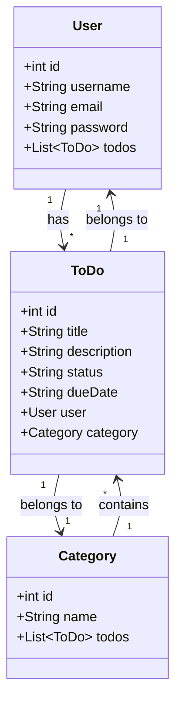

```mermaid
classDiagram
    class User {
        +int id
        +String username
        +String email
        +String password
        +List~ToDo~ todos
    }

    class ToDo {
        +int id
        +String title
        +String description
        +String status
        +String dueDate
        +User user
        +Category category
    }

    class Category {
        +int id
        +String name
        +List~ToDo~ todos
    }

    User "1" --> "*" ToDo : has
    Category "1" --> "*" ToDo : contains
    ToDo "1" --> "1" User : belongs to
    ToDo "1" --> "1" Category : belongs to

```
