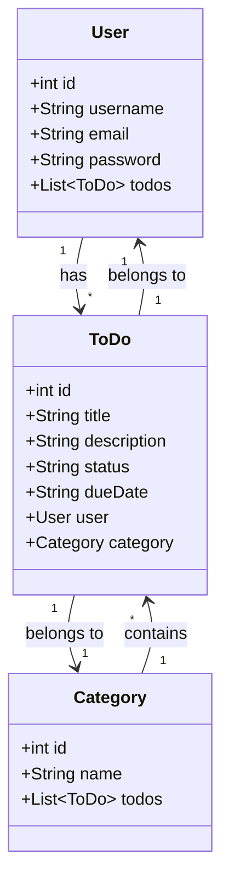

# Projeto: Sistema de Gestão de Usuários
## Descrição
Este projeto é uma API RESTful desenvolvida em Java utilizando o framework Spring Boot. O objetivo do sistema é gerenciar uma lista de tarefas, permitindo operações básicas de CRUD (Criar, Ler, Atualizar e Deletar) em uma base de dados. A API oferece endpoints para criação de novos usuários, recuperação de informações de usuários existentes, atualização de dados e remoção de usuários do sistema, assim como de tarefas e de categorias.

## Diagrama de classes

